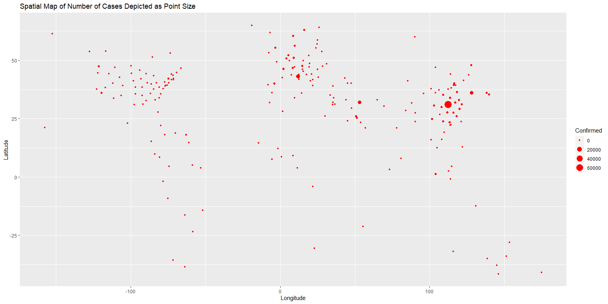
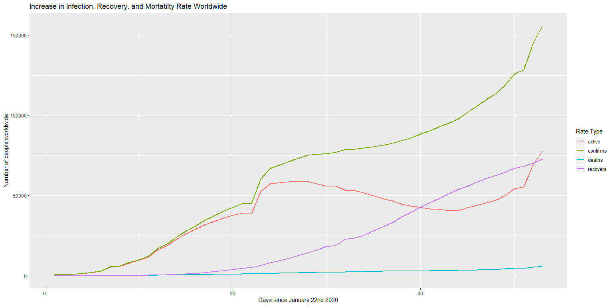
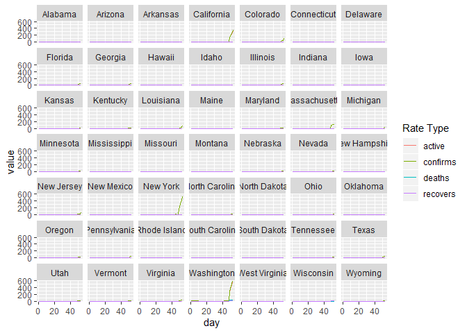
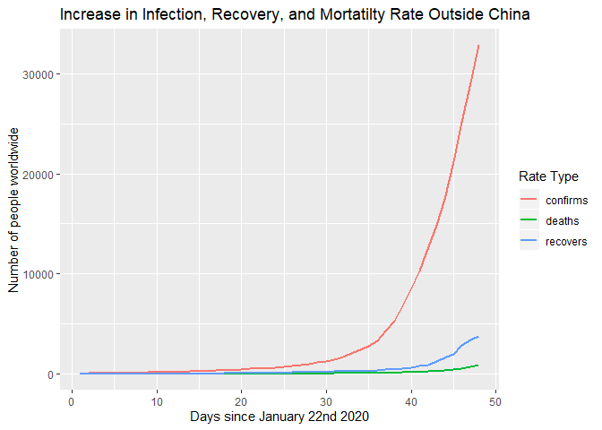

COVID-19 Infection,Recovery, and Mortality Rates
================

Rates in the US by County/State today:

Plot of Infection, Recovery and Mortality Rates Worldwide

``` r
# Get a summary table of the increasing number of cases day by day worldwide #
a <- data.frame()
for(i in h){
  if(is_empty(a)){
    a <- i %>% summarize(confirms = sum(Confirmed,na.rm = T),
                         deaths = sum(Deaths,na.rm = T),
                         recovers = sum(Recovered,na.rm = T))
  } else{
    a <- a %>% rbind(i %>% summarize(confirms = sum(Confirmed,na.rm = T),
                                     deaths = sum(Deaths,na.rm = T),
                                     recovers = sum(Recovered,na.rm = T)))
  }
}
a <- a %>% mutate(day = 1:nrow(a))
a <- a %>% select(day,confirms,deaths,recovers)
b <- a %>% pivot_longer(cols = c("confirms","deaths","recovers"),names_to = "Rate Type")
# ::::::::::::::::::::::::::::::::::::::::::::::::::::::::::::::: #

p <- b %>% ggplot(mapping = aes(x = day,color = `Rate Type`))

p + geom_line(mapping = aes(y = value),size = 1) + 
  labs(x = "Days since January 22nd 2020",
       y = "Number of people worldwide",
       title = "Increase in Infection, Recovery, and Mortatilty Rate")
```

<!-- -->

``` r
p + geom_line(mapping = aes(y = log(value)),size = 0.8) +
   labs(x = "Days since January 22nd 2020",
       y = "Log Number of people worldwide",
       title = "Log Increase in Infection, Recovery, and Mortatilty Rate")
```

<!-- -->

Rate of increase not in China

``` r
notChina <- data.frame()
for(i in h){
  if(is_empty(notChina)){
    notChina <- i %>% filter(!grepl("China",i[['Country/Region']])) %>%  summarize(confirms = sum(Confirmed,na.rm = T),
               deaths = sum(Deaths,na.rm = T),
               recovers = sum(Recovered,na.rm = T))
  } else{
    notChina <- notChina %>% rbind(i %>% filter(!grepl("China",i[['Country/Region']])) %>% 
summarize(confirms = sum(Confirmed,na.rm = T),
          deaths = sum(Deaths,na.rm = T),
          recovers = sum(Recovered,na.rm = T)))
  }
}

notChina <- notChina %>% mutate(day = 1:nrow(a))
notChina <- notChina %>% select(day,confirms,deaths,recovers)
nC <- notChina %>% pivot_longer(cols = c("confirms","deaths","recovers"),names_to = "Rate Type")

p <- nC %>% ggplot(mapping = aes(x = day,color = `Rate Type`))

p + geom_line(mapping = aes(y = value),size = 1) + 
  labs(x = "Days since January 22nd 2020",
       y = "Number of people worldwide",
       title = "Increase in Infection, Recovery, and Mortatilty Rate Outside China")
```

<!-- -->

``` r
p + geom_line(mapping = aes(y = log(value)),size = 0.8) +
   labs(x = "Days since January 22nd 2020",
       y = "Log Number of people worldwide",
       title = "Log Increase in Infection, Recovery, and Mortatilty Rate Outside China")
```

<!-- -->

-----

*What is the Rate of growth?* If the spread of infection grows
exponentially with: N(t) = A \* N(t-1)

Overall Rate—

``` r
#Overall rate of exponential growth so far:
mean(props) -> k

print("Overall rate of growth since January 22nd:")
```

    ## [1] "Overall rate of growth since January 22nd:"

``` r
print(ifelse( k < 1 ,str_c("Number of cases is decreasing by, ",100*(k)," percent per day") ,str_c("Number of cases is increasing by, ",100*(k)," percent per day")))
```

    ## [1] "Number of cases is increasing by, 113.610485665333 percent per day"

Rate For the First 4 Weeks—

``` r
# The mean rate for the first 4 weeks:

k <- mean(props[1:28])

print("In the first 4 weeks:")
```

    ## [1] "In the first 4 weeks:"

``` r
print(ifelse( k < 1 ,str_c("Number of cases decreased by, ",100*(k)," percent per day") ,str_c("Number of cases increased by, ",100*(k)," percent per day")))
```

    ## [1] "Number of cases increased by, 120.65917266306 percent per day"

Rate for the last 3 Weeks—

``` r
#The Rate for the past 3 weeks:
mean(props[(length(props)-21):length(props)]) -> k

print("In the last 3 weeks:")
```

    ## [1] "In the last 3 weeks:"

``` r
print(ifelse( k < 1 ,str_c("Number of cases is decreasing by, ",100*(k)," percent per day") ,str_c("Number of cases is increasing by, ",100*(k)," percent per day")))
```

    ## [1] "Number of cases is increasing by, 102.113125635354 percent per day"

*If it is increasing by 100% then this ‘means’ that on average a person
with the virus only infects one other person. In terms of exponential
growth as this constant goes from \> 1 to \< 1 this could mean that the
rate of increase in cases is decreasing and there is no longer
exponential growth. Examining this rate in recent chunks allows us to
gauge what the current situation is in terms of how it is growing. Any
positive number means more cases, but if we dip below 100% growth in a
day it could mean that transmission will start to taper out.*
