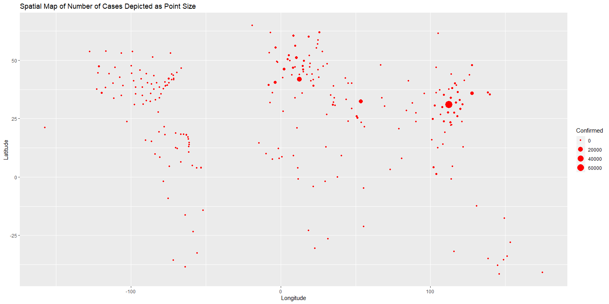
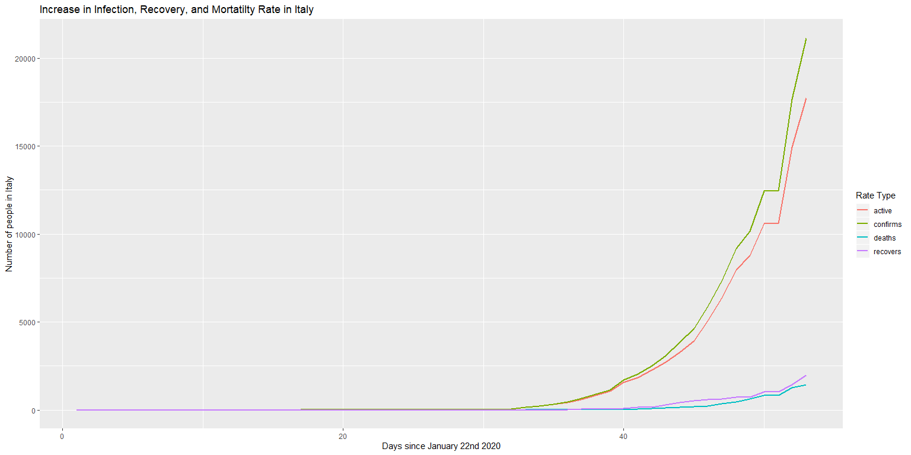
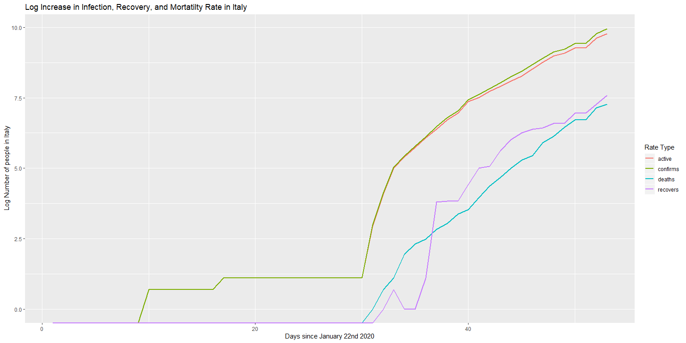

COVID-19 Infection,Recovery, and Mortality Rates
================

<!-- ```{r include=F} -->

<!-- # downloads all data from 1-22-2020 to today -->

<!-- h <- list() -->

<!-- todayInMarch <- as.numeric(substring(date(),9,10)) -->

<!-- day <- 22:31 -->

<!-- count <- 1 -->

<!-- for(d in day){ -->

<!--   url <- str_c("https://raw.githubusercontent.com/CSSEGISandData/COVID-19/master/csse_covid_19_data/csse_covid_19_daily_reports/01-",d,"-2020.csv") -->

<!--   print(url) -->

<!--   h[[count]] <- fread(url) -->

<!--   count <- count+1 -->

<!-- } -->

<!-- day <- c(str_c("0",1:9),10:29) -->

<!-- for(d in day){ -->

<!--   url <- str_c("https://raw.githubusercontent.com/CSSEGISandData/COVID-19/master/csse_covid_19_data/csse_covid_19_daily_reports/02-",d,"-2020.csv") -->

<!--   print(url) -->

<!--   h[[count]] <- fread(url) -->

<!--   count <- count+1 -->

<!-- } -->

<!-- day <- c(str_c("0",1:9),10:(todayInMarch-1)) -->

<!-- for(d in day){ -->

<!--   url <- str_c("https://raw.githubusercontent.com/CSSEGISandData/COVID-19/master/csse_covid_19_data/csse_covid_19_daily_reports/03-",d,"-2020.csv") -->

<!--   print(url) -->

<!--   h[[count]] <- fread(url) -->

<!--   count <- count+1 -->

<!-- } -->

<!-- ``` -->

    ## # A tibble: 12 x 5
    ##    `Country/Region`      confirms deaths recovers active
    ##    <chr>                    <int>  <int>    <int>  <int>
    ##  1 China                    80977   3193    65660  12124
    ##  2 France                    4480     91       12   4377
    ##  3 Germany                   4585      9       46   4530
    ##  4 Iran                     12729    611     2959   9159
    ##  5 Italy                    21157   1441     1966  17750
    ##  6 Korea, South              8086     72      510   7504
    ##  7 Norway                    1090      3        1   1086
    ##  8 Spain                     6391    195      517   5679
    ##  9 Switzerland               1359     13        4   1342
    ## 10 United Kingdom            1143     21       19   1103
    ## 11 US                        2726     54       12   2660
    ## 12 ---Worldwide Total---   156099   5819    72624  77656

    ## [1] "There will be at least 877 new ~confirmed~ cases in the US at the end of today."

*Plots:*
<!-- --><!-- --><!-- --><!-- --><!-- --><!-- --><!-- --><!-- --><!-- -->
\_\_\_\_ *US Rates:*

    ## [1] "The average rate of growth in the US since 1-22-2020 is a 0.195200315075535 percent increase in confirmed cases daily"

*If it is increasing by 0% then this means there were no new cases in
that day. In terms of exponential growth as this constant goes from \> 0
to \< 0 this could mean that the rate of increase in cases is decreasing
and there is no longer exponential growth. Examining this rate in recent
chunks allows us to gauge what the current situation is in terms of how
it is growing. Any positive number means continued exponential growth.
But if it is 0 or less it could mean that transmission will start to
taper out.*
