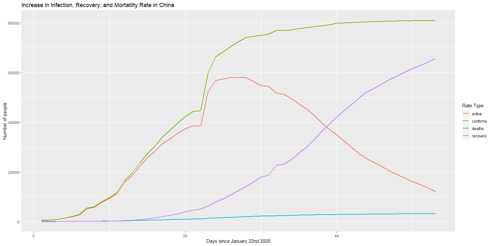
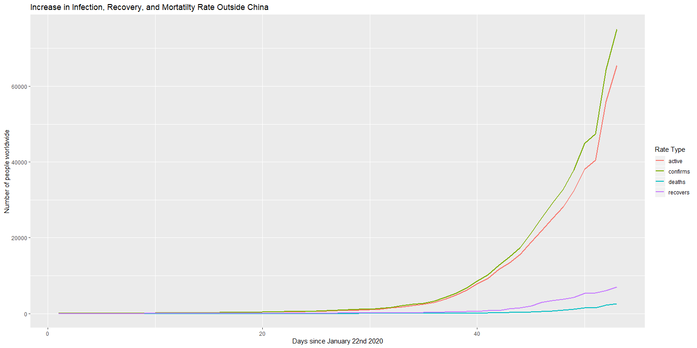
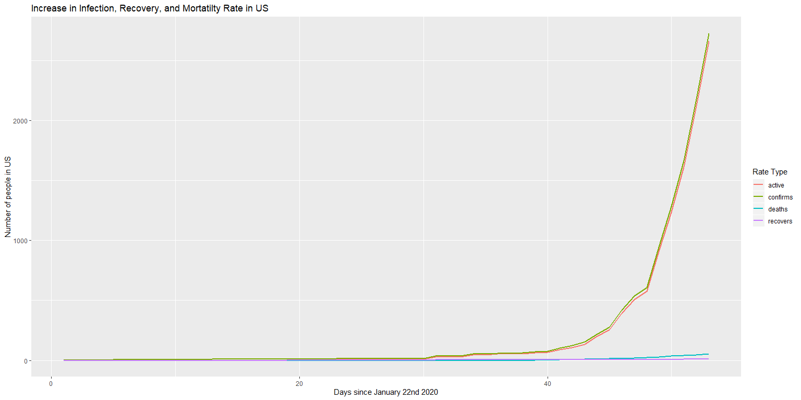

COVID-19 Infection,Recovery, and Mortality Rates
================

<!-- ```{r include=F} -->

<!-- # downloads all data from 1-22-2020 to today -->

<!-- h <- list() -->

<!-- todayInMarch <- as.numeric(substring(date(),9,10)) -->

<!-- day <- 22:31 -->

<!-- count <- 1 -->

<!-- for(d in day){ -->

<!--   url <- str_c("https://raw.githubusercontent.com/CSSEGISandData/COVID-19/master/csse_covid_19_data/csse_covid_19_daily_reports/01-",d,"-2020.csv") -->

<!--   print(url) -->

<!--   h[[count]] <- fread(url) -->

<!--   count <- count+1 -->

<!-- } -->

<!-- day <- c(str_c("0",1:9),10:29) -->

<!-- for(d in day){ -->

<!--   url <- str_c("https://raw.githubusercontent.com/CSSEGISandData/COVID-19/master/csse_covid_19_data/csse_covid_19_daily_reports/02-",d,"-2020.csv") -->

<!--   print(url) -->

<!--   h[[count]] <- fread(url) -->

<!--   count <- count+1 -->

<!-- } -->

<!-- day <- c(str_c("0",1:9),10:(todayInMarch-1)) -->

<!-- for(d in day){ -->

<!--   url <- str_c("https://raw.githubusercontent.com/CSSEGISandData/COVID-19/master/csse_covid_19_data/csse_covid_19_daily_reports/03-",d,"-2020.csv") -->

<!--   print(url) -->

<!--   h[[count]] <- fread(url) -->

<!--   count <- count+1 -->

<!-- } -->

<!-- ``` -->

    ## # A tibble: 9 x 5
    ##   `Country/Region`      confirms deaths recovers active
    ##   <chr>                    <int>  <int>    <int>  <int>
    ## 1 China                    80932   3172    62901  14859
    ## 2 France                    2284     48       12   2224
    ## 3 Germany                   2078      3       25   2050
    ## 4 Iran                     10075    429     2959   6687
    ## 5 Italy                    12462    827     1045  10590
    ## 6 Korea, South              7869     66      333   7470
    ## 7 Spain                     2277     55      183   2039
    ## 8 US                        1663     40       12   1611
    ## 9 ---Worldwide Total---   128343   4720    68324  55299

    ## [1] "There will be at least 413 new ~confirmed~ cases in the US at the end of today."

*Plots:*
<!-- --><!-- --><!-- --><!-- --><!-- --><!-- --><!-- --><!-- --><!-- -->
\_\_\_\_ *US Rates:*

    ## [1] "The average rate of growth in the US since 1-22-2020 is a 0.191782023568118 percent increase in confirmed cases daily"

*If it is increasing by 0% then this means there were no new cases in
that day. In terms of exponential growth as this constant goes from \> 0
to \< 0 this could mean that the rate of increase in cases is decreasing
and there is no longer exponential growth. Examining this rate in recent
chunks allows us to gauge what the current situation is in terms of how
it is growing. Any positive number means continued exponential growth.
But if it is 0 or less it could mean that transmission will start to
taper out.*
