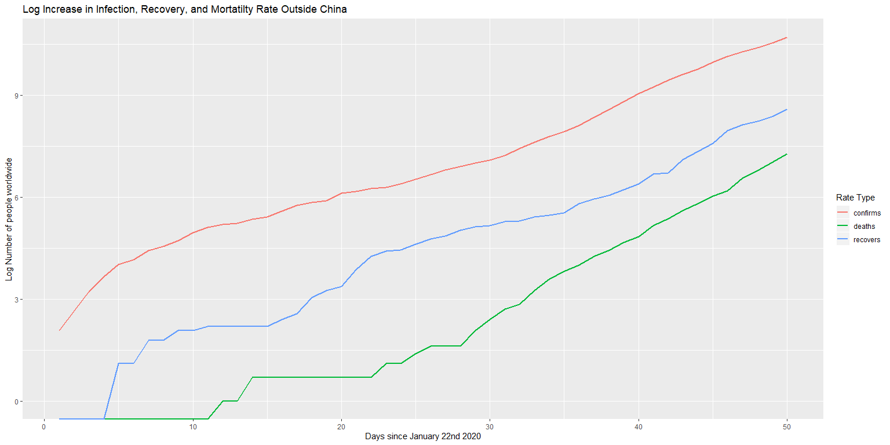
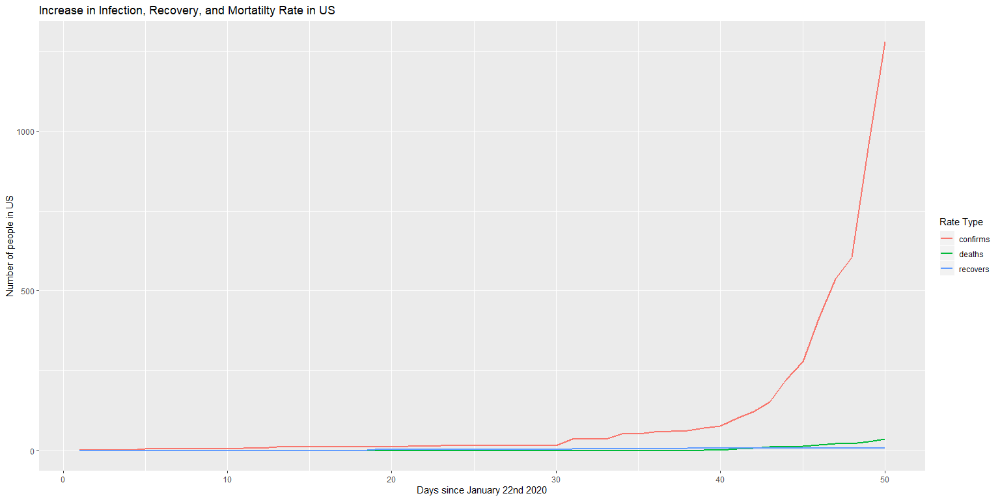
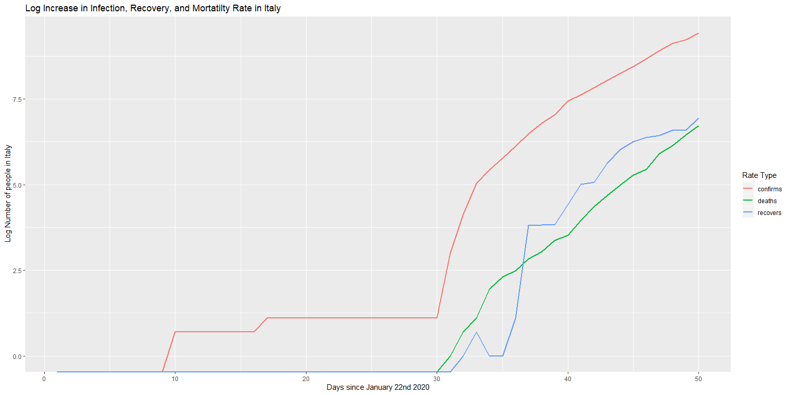

COVID-19 Infection,Recovery, and Mortality Rates
================

    ## [1] "As of:  Wed Mar 11 12:49:56 2020"

    ## [1] "Worldwide = 118582 cases-------One Week Ago = 92844"

    ## [1] "China = 80757 cases-------One Week Ago = 80151"

    ## [1] "Italy = 10149 cases-------One Week Ago = 2502"

    ## [1] "US = 959 cases-------One Week Ago = 122"

*Plots:*
<!-- --><!-- --><!-- --><!-- --><!-- --><!-- --><!-- --><!-- -->
\_\_\_\_ *US Rates:*

    ## [1] "The average rate of growth in the US since 1-22-2020 is a 0.18656521306949 percent increase in confirmed cases daily"

*If it is increasing by 0% then this means there were no new cases in
that day. In terms of exponential growth as this constant goes from \> 0
to \< 0 this could mean that the rate of increase in cases is decreasing
and there is no longer exponential growth. Examining this rate in recent
chunks allows us to gauge what the current situation is in terms of how
it is growing. Any positive number means continued exponential growth.
But if it is 0 or less it could mean that transmission will start to
taper out.*
